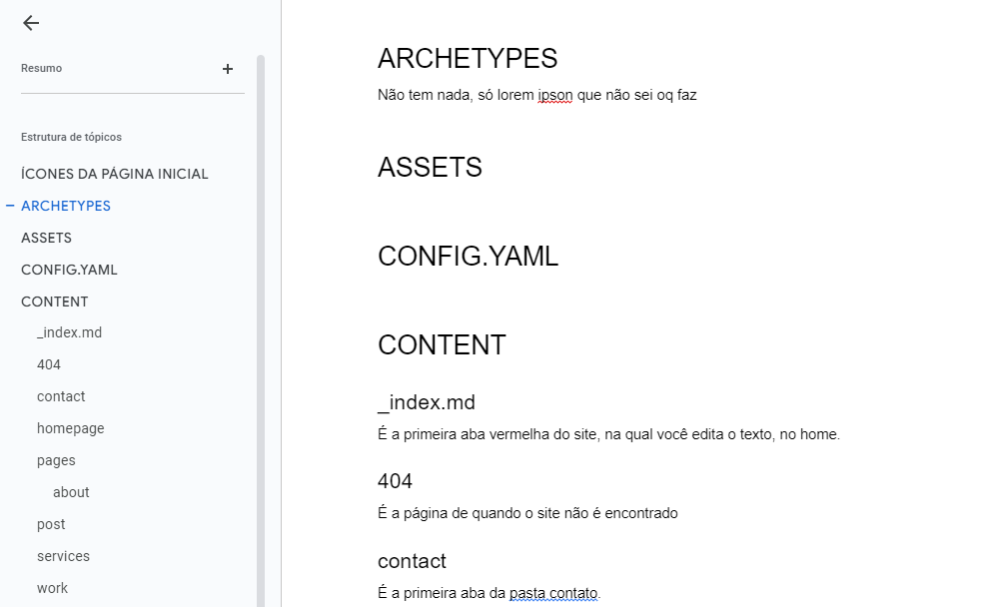

``` {r xaringan-logo, echo = FALSE, warning = FALSE} 
library(xaringanExtra)
use_logo(
  "estats.png",
  width = "0px",
  height = "0px",
  position = css_position(top = "0.5em", right = "1em"),
  link_url = NULL,
  exclude_class = c("title-slide", "inverse", "hide_logo")
)

```


``` {r xaringan-themer, include = FALSE}
library(xaringanthemer)
style_mono_accent(
  base_color = "red"
)

```

```{r setup, include=FALSE}
options(htmltools.dir.version = FALSE)
```


# A documentação do site

<center>
<br>

</center>

---

# Manual de sobrevivência

<center>

</center>

---

# Um possível projeto futuro

<center>

</center>

---

```{r, echo = FALSE}
knitr::include_app("https://yihui.shinyapps.io/miniUI/",
                   height = "600px")
```


